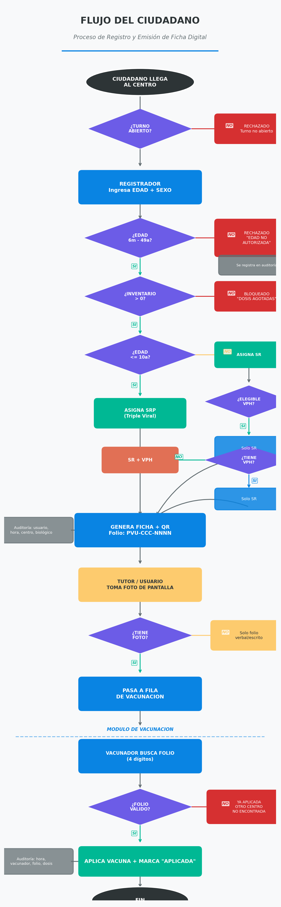
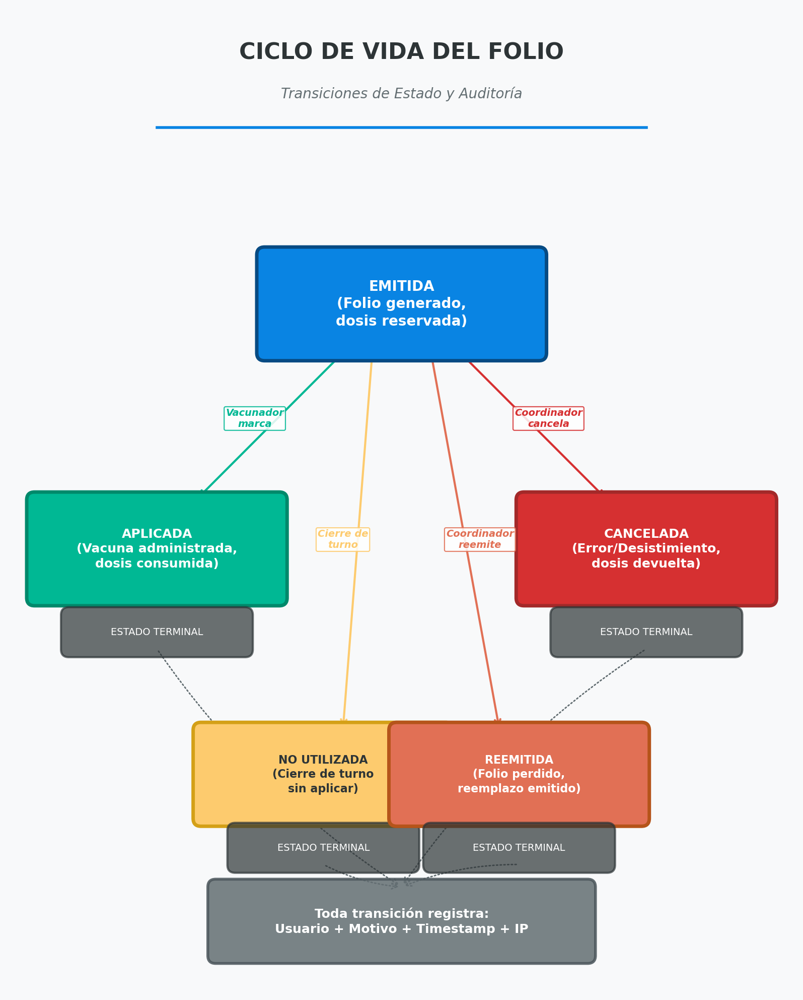

## PROPUESTA METODOLÓGICA PARA MONITOREO DE LA VACUNACIÓN CONTRA SARAMPIÓN EN EL ESTADO DE DURANGO

## Estrategia Integral para la Gestión de Flujos y Trazabilidad de Insumos (SRP / SR )

### **Fecha:** 17 de febrero de 2026

## 1. Justificación

**El Problema:**
La emergencia sanitaria por sarampión ha desbordado la capacidad operativa de la red de Centros de Salud. La gestión manual actual provoca aglomeraciones peligrosas, tiempos de espera excesivos (>3 horas) y, críticamente, **opacidad en el consumo de vacunas**, impidiendo conocer la disponibilidad real de insumos hasta el corte diario.

**La Solución (REPORTE RÁPIDO):**
Implementación inmediata de una plataforma de **Triage Digital y Control de Aforo** que regula el acceso ciudadano estrictamente conforme a la disponibilidad real de biológicos (SRP, SR).

**Resultados Inmediatos:**

* **Orden Público y Seguridad:** Eliminación de filas caóticas y reducción del riesgo de contagio nosocomial.
* **Eficiencia de Recursos:** Asignación precisa de dosis según reglas de negocio automatizadas (Cero Desperdicio).
* **Gobernanza de Datos:** Tablero de control en tiempo real para la toma de decisiones basada en evidencia, no en suposiciones.

## 2. JUSTIFICACIÓN: DEL CAOS AL CONTROL

### Diagnóstico Situacional

La red de atención primaria (7 Centros de Salud urbanos) opera bajo presión extrema.

* **Riesgo Sanitario:** Hacinamiento de población vulnerable (niños < 10 años) en espacios cerrados.
* **Riesgo Administrativo:** Trazabilidad manual de insumos propensa a errores humanos y falta de integridad en los datos.
* **Costo de Oportunidad:** Pérdida sistemática de oportunidades de vacunación cruzada (VPH en niñas de 11-12 años que acuden por SR).

### Limitaciones del Modelo Actual ("Fichas de Papel")

La entrega física de turnos es **insuficiente**. No valida criterios de elegibilidad al ingreso, no se vincula con el inventario real y carece de auditoría. Es un mecanismo de ordenamiento precario, no una herramienta de gestión sanitaria.

## 3. ESTRATEGIA DE INTERVENCIÓN: SISTEMA TURNO-PVU

### Alcance Funcional Estratégico

1. **Filtro Inteligente:** Algoritmos que validan edad y sexo *antes* de emitir un turno, asegurando que solo la población objetivo consuma recursos.
2. **Inventario Perpetuo:** El sistema descuenta dosis en tiempo real. Si el inventario se agota, la emisión de fichas se bloquea automáticamente, evitando conflictos sociales en la fila.
3. **Captación Activa:** Detecta automáticamente niñas elegibles para VPH y sugiere la aplicación simultánea, optimizando cada visita.

### Delimitación (Lo que NO es)

Para garantizar una implementación ágil (48 horas):

* **NO es un padrón nominal:** No almacena datos sensibles (Nombres, CURP), garantizando la protección de datos personales.
* **NO depende de Internet crítico:** Diseñado con tecnología *Offline-First* para operar en zonas con conectividad intermitente.

## 4. FLUJO OPERATIVO CIUDADANO

La experiencia del usuario ha sido diseña para ser fluida, transparente y segura.

### Diagrama General del Proceso

### Narrativa del Flujo (Simulación Operativa)

**07:50 AM - Apertura**
El Coordinador declara el inventario físico (ej. 120 SRP, 25 VPH). El **Panel Público Digital** se actualiza al instante, informando a la ciudadanía el aforo disponible.

**08:05 AM - Triage y Emisión (Módulo de Registro)**

* Llega paciente. El Registrador ingresa Edad y Sexo.
* **Escenario A (Elegible):** Sistema valida criterios -> Emite Folio Digital (QR) -> Paciente pasa a vacunación.
* **Escenario B (No Elegible):** Sistema bloquea emisión -> Informa motivo normativo (ej. "Edad fuera de rango") -> Se evita el ingreso innecesario a la unidad.

**12:45 PM - Control de Stock**

* Inventario bajo. El sistema emite alertas visuales a los coordinadores.
* Al agotarse el insumo, el sistema **cierra automáticamente** la fila virtual. El personal cuenta con respaldo digital para informar a la ciudadanía, protegiendo su integridad ante reclamos.
* En caso de resurtir biológico, se actualiza cantidad de fichas disponibles

---

## 5. REGLAS DE NEGOCIO Y CICLO DE VIDA DEL FOLIO

La robustez del sistema radica en su lógica de asignación y en la trazabilidad de cada folio emitido.

### Matriz de Elegibilidad Automatizada

*Garantía de cumplimiento normativo sin depender de la memoria del personal.*

| Grupo Etario                 | Sexo       | Condición       | Biológico Asignado               |
| :--------------------------- | :--------- | :--------------- | :-------------------------------- |
| **< 6 meses**          | Indistinto | N/A              | ⛔**BLOQUEO** (No elegible) |
| **6 meses - 10 años** | Indistinto | N/A              | **SRP** (Triple Viral)      |
| **11 - 12 años**      | Femenino   | Sin antecedentes | **SR** (Doble viral)       |
| **13 - 49 años**      | Indistinto | Recuperación    | **SR** (Doble Viral)        |

### Trazabilidad Completa: El Ciclo de Vida del Folio

Cada ficha es un activo digital auditado en cada paso de su existencia.

* **EMITIDA:** El recurso (vacuna) está "reservado" virtualmente.
* **APLICADA:** La vacuna ha sido inoculada. Se confirma el consumo del inventario.
* **CANCELADA/NO UTILIZADA:** El recurso se libera y retorna al inventario disponible automáticamente.

---

## 6. BENEFICIOS ADMINISTRATIVOS Y DE CONTROL GUBERNAMENTAL

Esta solución aporta valor directo a la gestión pública en tres ejes fundamentales:

### A. Transparencia y Rendición de Cuentas (Auditoría)

* **Quién:** Cada movimiento queda registrado asociado a un usuario responsable (Registrador/Vacunador).
* **Qué:** Auditoría exacta de dosis aplicadas vs. existencias físicas. Eliminación de "mermas no justificadas".
* **Cuándo:** Trazabilidad temporal exacta. Se sabe a qué velocidad opera cada célula de vacunación.

### B. Optimización de Recursos (Eficiencia)

* **Reducción de Desperdicio:** Al asignar turnos exactos, se evita abrir frascos multidosis innecesarios al final de la jornada.
* **Personal:** El personal de enfermería se dedica exclusivamente a vacunar, liberándose de tareas de conteo manual y gestión de filas.

### C. Impacto Político y Social (Percepción)

* **Modernización:** Imagen de un gobierno que responde con tecnología y orden ante la crisis.
* **Atención Ciudadana:** Reducción de la fricción social. El ciudadano percibe un proceso justo, transparente y ágil.

---

## 7. OBJETIVOS ESPECÍFICOS Y MÉTRICAS DE ÉXITO

| Objetivo Estratégico          | Indicador Clave (KPI)                           | Meta                          |
| :----------------------------- | :---------------------------------------------- | :---------------------------- |
| **Control de Aforo**     | % de Fichas Emitidas vs Capacidad Instalada     | ≤ 100% (Nunca exceder stock) |
| **Eficiencia Operativa** | Tiempo promedio de atención (Llegada - Salida) | < 45 minutos                  |
| **Cobertura VPH**        | % Capta de niñas de 11-12 años sin esquema    | > 85% de las asistentes       |
| **Calidad del Dato**     | Coincidencia Inventario Físico vs Digital      | > 98%                         |

## 8. CRONOGRAMA DE IMPLEMENTACIÓN

Diseñado para despliegue inmediato bajo esquema de emergencia.

| Fase                                       | Alcance                            | Hito Clave                                          |
| :----------------------------------------- | :--------------------------------- | :-------------------------------------------------- |
| **Fase 1: Piloto Controlado**        | 7 Centros de Salud de Alta Demanda | Validación de flujo y ajustes en campo (24 hrs).   |
| **Fase 2: Expansión de estrategia** | 7 Centros de Salud (Cabeceras)     | Despliegue de equipamiento y capacitación express. |
| **Fase 3: Cobertura Total**          | Red Completa (7 Unidades)          | Operación estandarizada y monitoreo centralizado.  |
